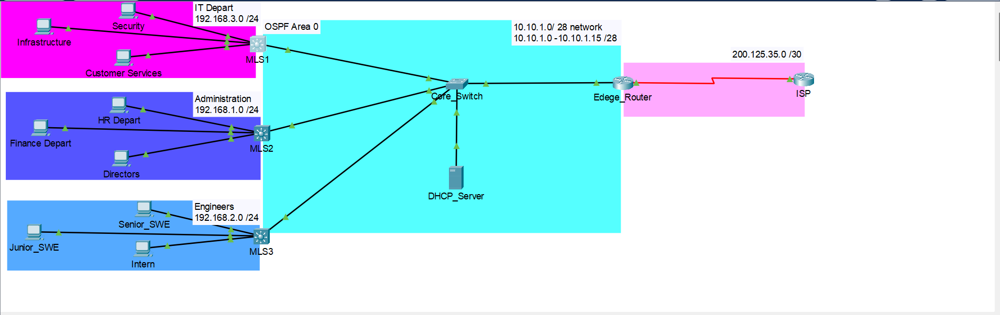

# Multi-Building Enterprise Network Simulation

A simulated multi-building enterprise network built in **Cisco Packet Tracer**, designed to replicate a mid-scale organization with three separate departments across three buildings, a centralized core network, and full OSPF-based inter-building routing. This project is a deliberate step up in complexity from the previous small enterprise project — focusing on dynamic routing, multi-building Layer 3 architecture, centralized network services, access control, and network security.

---

## Network Topology



> *Three buildings each with a dedicated MLS, connected to a central core switch. Edge router connects the core network to the ISP via a serial WAN link. Standalone DHCP server sits in the core network segment.*

---

## Technology Summary

| Technology | Implementation Details |
|---|---|
| **VLSM** | Each building uses a dedicated /24 address space subdivided into /26 subnets per VLAN |
| **VLANs** | Three department VLANs per building plus native VLAN (60) and inactive VLAN (99) |
| **MLS Inter-VLAN Routing** | Each building MLS handles inter-VLAN routing via SVIs — no ROAS |
| **OSPF** | Single-area OSPF (Area 0) across all MLS devices and edge router |
| **Standalone DHCP Server** | Centralized DHCP server at `10.10.1.5` serving all buildings via `ip helper-address` relay |
| **PAT (NAT Overload)** | Edge router translates all internal traffic to a pool of 5 public addresses |
| **ACLs** | Inter-building traffic restrictions, intern isolation, SSH access control |
| **SSH** | SSH v2 only on all MLS devices and edge router; restricted to IT Department only |
| **Port Security** | Sticky MAC learning on all active access ports; violation mode: restrict |
| **PortFast + BPDU Guard** | Enabled on all access ports across all three buildings |
| **Routed Ports** | MLS uplinks to core switch configured as Layer 3 routed ports (`no switchport`) |

---

## Network Addressing

### Core Network — 10.10.1.0 /28

| Device | Interface | IP Address | Role |
|---|---|---|---|
| Edge Router | G0/0/0 | 10.10.1.1 /28 | Core gateway, OSPF, NAT inside |
| MLS1 (IT Dept) | G0/1 | 10.10.1.2 /28 | Building 1 uplink |
| MLS2 (Administration) | G0/1 | 10.10.1.3 /28 | Building 2 uplink |
| MLS3 (Engineers) | G0/1 | 10.10.1.4 /28 | Building 3 uplink |
| DHCP Server | F0 | 10.10.1.5 /28 | Centralized DHCP |
| Edge Router (WAN) | S0/1/0 | 200.125.35.2 /30 | ISP link, NAT outside |
| ISP | S0/1/0 | 200.125.35.1 /30 | — |

### OSPF Router IDs

| Device | Router ID |
|---|---|
| Edge Router | 100.100.100.100 |
| MLS1 | 3.3.3.3 |
| MLS2 | 1.1.1.1 |
| MLS3 | 2.2.2.2 |

---

## VLAN & IP Addressing Table

### Building 1 — IT Department (192.168.3.0 /24)

| VLAN | Name | Subnet | Gateway | Usable Range |
|---|---|---|---|---|
| 10 | Security | 192.168.3.0 /26 | 192.168.3.1 | 192.168.3.2 – 192.168.3.63 |
| 20 | Infrastructure | 192.168.3.64 /26 | 192.168.3.65 | 192.168.3.66 – 192.168.3.127 |
| 30 | Customer Service | 192.168.3.128 /26 | 192.168.3.129 | 192.168.3.130 – 192.168.3.191 |
| 60 | Native VLAN | — | — | — |
| 99 | Inactive | — | — | — |

### Building 2 — Administration (192.168.1.0 /24)

| VLAN | Name | Subnet | Gateway | Usable Range |
|---|---|---|---|---|
| 10 | HR Department | 192.168.1.0 /26 | 192.168.1.1 | 192.168.1.2 – 192.168.1.63 |
| 20 | Finance Department | 192.168.1.64 /26 | 192.168.1.65 | 192.168.1.66 – 192.168.1.127 |
| 30 | Directors | 192.168.1.128 /26 | 192.168.1.129 | 192.168.1.130 – 192.168.1.191 |
| 60 | Native VLAN | — | — | — |
| 99 | Inactive | — | — | — |

### Building 3 — Engineers (192.168.2.0 /24)

| VLAN | Name | Subnet | Gateway | Usable Range |
|---|---|---|---|---|
| 10 | Senior SWE | 192.168.2.0 /26 | 192.168.2.1 | 192.168.2.2 – 192.168.2.63 |
| 20 | Junior SWE | 192.168.2.64 /26 | 192.168.2.65 | 192.168.2.66 – 192.168.2.127 |
| 30 | Intern | 192.168.2.128 /26 | 192.168.2.129 | 192.168.2.130 – 192.168.2.191 |
| 60 | Native VLAN | — | — | — |
| 99 | Inactive | — | — | — |

> **First usable address per subnet** is assigned to the MLS SVI as the default gateway. No additional addresses are excluded.

---

## OSPF Design

All devices participate in a single OSPF Area 0. Reference bandwidth is set to 10,000 on all devices to ensure accurate cost calculation for modern link speeds — the default 100 Mbps reference bandwidth does not differentiate between FastEthernet and GigabitEthernet.

Each MLS advertises its three /26 building subnets directly into Area 0 via OSPF network statements. The edge router uses `default-information originate` to propagate the default route to all OSPF participants.

Each MLS also has a static default route (`ip route 0.0.0.0 0.0.0.0`) pointing to its respective next-hop to ensure unknown traffic is forwarded correctly toward the edge router. Traffic destined for unknown networks was confirmed via Packet Tracer simulation mode to be forwarding through the WAN link to the ISP. The default route does not appear as an explicit OSPF entry in MLS routing tables — this is a known Packet Tracer behavior and is documented as an open observation.

---

## NAT Configuration

| Parameter | Value |
|---|---|
| Type | PAT (NAT Overload) |
| Internal networks | 192.168.1.0 – 192.168.3.0 (all /26 subnets) |
| Public pool | 200.100.150.1 – 200.100.150.5 |
| NAT inside | G0/0/0 (core network) |
| NAT outside | S0/1/0 (WAN link) |

All nine /26 subnets across the three buildings are explicitly permitted in ACL 1 for NAT translation. Named ACL was used instead of numbered ACL to avoid IOS auto-summarization behavior which was bundling subnets into an unintended `0.0.0.0/26` entry — a security risk that would have allowed any /26 network to reach the internet.

---

## ACL Design

### SSH Access Control — `SSH_LOGIN`
Applied on VTY lines (`access-class SSH_LOGIN in`) on all MLS devices and the edge router.

**Policy:** Only IT Department (Building 1 — `192.168.3.0/24`) can SSH into any network device.

```
permit 192.168.3.0 0.0.0.63
permit 192.168.3.64 0.0.0.63
permit 192.168.3.128 0.0.0.63
```

---

### Inter-Building Restrictions

**`Block_Building3`** — Applied **inbound on MLS2 G0/1**

**Policy:** Building 2 (Administration) cannot communicate with Building 3 (Engineers).

```
deny   192.168.2.0 0.0.0.255
permit any
```

**`Block_Building2`** — Applied **inbound on MLS3 G0/1**

**Policy:** Building 3 (Engineers) cannot communicate with Building 2 (Administration).

```
deny   192.168.1.0 0.0.0.255
permit any
```

> Building 1 (IT Department) can communicate with both Building 2 and Building 3. Buildings 2 and 3 can communicate with Building 1 but not with each other.

---

### Intern Isolation — `Intern_Block`
Applied **outbound on MLS3 VLAN 10 (Senior SWE) and VLAN 20 (Junior SWE)** SVIs.

**Policy:** Intern subnet (`192.168.2.128/26`) cannot communicate with Senior SWE or Junior SWE networks.

```
deny   192.168.2.128 0.0.0.63
permit any
```

**Known limitation:** The reverse — allowing Senior/Junior to initiate connections to Interns while blocking Interns from initiating to Senior/Junior — requires stateful inspection which cannot be achieved with ACLs alone. This will be implemented in a future dedicated stateful inspection project. For this project, Interns are fully blocked from communicating with Senior and Junior SWE networks.

---

### ACL Summary Table

| ACL Name | Type | Applied On | Direction | Policy |
|---|---|---|---|---|
| `SSH_LOGIN` | Standard | All VTY lines | Inbound | Only IT Dept can SSH |
| `Block_Building3` | Standard | MLS2 G0/1 | Inbound | Block Building 3 from Building 2 |
| `Block_Building2` | Standard | MLS3 G0/1 | Inbound | Block Building 2 from Building 3 |
| `Intern_Block` | Standard | MLS3 Vlan10, Vlan20 | Outbound | Block Interns from Senior/Junior |
| ACL 1 (NAT) | Standard | Edge Router | NAT source | Permit all internal subnets for PAT |

---

## Security Summary

| Layer | Controls Applied |
|---|---|
| Physical / Layer 1 | All unused ports assigned to VLAN 99 and shutdown |
| Layer 2 | Port Security (sticky MAC, restrict violation), PortFast, BPDU Guard, Non-default native VLAN (60) |
| Layer 3 | OSPF, ACLs (inter-building, intern isolation), PAT/NAT |
| Management Plane | SSH v2 only, local authentication, restricted to IT Department via ACL |

**Note on DHCP Snooping and DAI:** DHCP Snooping was enabled globally but the `ip dhcp snooping trust` command was not available on the MLS G0/1 routed interface in Packet Tracer — the command was unrecognized on a `no switchport` interface. This is a Packet Tracer limitation. In a real network, the uplink interface would be configured as a trusted port. Because DHCP Snooping could not be fully configured, DAI was also not implemented as it depends on the DHCP snooping binding table. ARP ACLs are an alternative but were outside the scope of this project.

---

## Design Decisions

**Why MLS instead of dedicated building routers?**
The original design included dedicated routers per building connected to each MLS via /30 links. OSPF was not advertising the internal building subnets (`192.168.X.0/24`) to the rest of the network. OSPF cannot advertise a network it is not directly part of — since the router interfaces were in `10.X.X.0/30` space, they had no knowledge of the internal subnets even with a network statement. Removing the building routers and connecting each MLS directly to the core switch as a Layer 3 routed device resolved this. MLS devices handle both inter-VLAN routing and OSPF participation, making dedicated building routers redundant.

**Why routed ports (`no switchport`) on MLS uplinks?**
Initial MLS uplinks to the core switch were configured as trunk switchports, causing them to operate at Layer 2 and preventing routing. Converting uplinks to routed ports with dedicated IP addresses allowed proper Layer 3 communication between each MLS and the core network.

**Why a single OSPF area?**
Multi-area OSPF was considered during planning. Given that all three buildings connect to a single core switch and the total number of routes is manageable, the complexity of multi-area OSPF was not justified. Single Area 0 is simpler, easier to troubleshoot, and appropriate for this topology.

**Why a standalone DHCP server?**
Centralizing DHCP on a dedicated server reflects real enterprise practice. Each MLS uses `ip helper-address 10.10.1.5` to relay DHCP requests from hosts to the central server, which is simpler to manage and audit than per-router DHCP pools.

**Why is WLC not included?**
WLC and wireless networking were part of the original scope but removed mid-project. The routing and security complexity was already significant and adding WLC would have compromised the quality of both. A dedicated standalone wireless project will be built separately.

---

## Challenges & Troubleshooting

**1. OSPF not advertising internal building subnets**
Dedicated building routers were connected to each MLS via /30 links. OSPF neighbors were forming and the process looked healthy, but `192.168.X.0/24` subnets never appeared in the edge router's routing table. Research revealed that OSPF cannot advertise a network it is not directly part of — the router interfaces were in `10.X.X.0/30` space so OSPF had no knowledge of the internal subnets regardless of the network statement. Resolved by removing building routers entirely and connecting each MLS directly to the core switch as a Layer 3 device.

**2. MLS uplink behaving as a Layer 2 switch**
Inter-VLAN routing within each building was working but the MLS could not communicate beyond the building. The uplink to the core switch was configured as a trunk switchport, operating at Layer 2. Converted to a routed port using `no switchport` and assigned a dedicated IP address. Small command, non-obvious problem.

**3. OSPF neighbors not forming on edge router**
All three MLS devices were forming adjacencies with each other but not with the edge router. OSPF config, area assignments, and router IDs all appeared correct. Eventually found that MLS interfaces were configured with a /29 mask (`255.255.255.248`) instead of the correct /28 (`255.255.255.240`). A one-bit difference was enough for OSPF hello packets to be rejected. Correcting the mask resolved adjacency immediately.

**4. Default route not appearing explicitly in MLS routing tables**
The edge router had a static default route and `default-information originate` configured but the default route was not appearing as an OSPF entry in MLS routing tables. `clear ip ospf process` was attempted but did not fully resolve it. However, Packet Tracer simulation mode confirmed that traffic to unknown destinations (e.g. `8.8.8.8`) was being forwarded through the WAN link — so default route forwarding is functioning. This is documented as an open observation and suspected Packet Tracer behavior.

**5. NAT ACL showing `0.0.0.0` instead of configured subnets**
Initial NAT configuration used a numbered ACL (ACL 1) with individual permit statements per subnet. The `show access-list` output displayed `0.0.0.0` rather than the expected subnet entries. The exact cause was not conclusively identified — suspected to be either entering permit statements outside the ACL subconfig mode, or accidentally using a netmask instead of a wildcard mask. Packet Tracer is generally tolerant of netmask vs wildcard mixups but this was flagged as a possible cause. Switched to a named ACL using `ip access-list standard` which produced the correct per-subnet entries as intended.

**6. DHCP Snooping trust command unavailable on routed port**
DHCP Snooping was enabled globally but `ip dhcp snooping trust` was not available on the MLS G0/1 routed interface (`no switchport`). The command was unrecognized. This is a Packet Tracer limitation — the trust command is only available on Layer 2 switchport interfaces in this simulator. DAI was also not implemented as a result.

---

## Testing Results

| Test | Result |
|---|---|
| Inter-VLAN routing — Building 1 | ✅ Working |
| Inter-VLAN routing — Building 2 | ✅ Working |
| Inter-VLAN routing — Building 3 | ✅ Working |
| OSPF neighbor adjacencies — all devices | ✅ Working |
| OSPF route propagation across all devices | ✅ Working |
| Cross-building communication — all buildings | ✅ Working |
| DHCP address assignment — all VLANs all buildings | ✅ Working |
| DHCP lease verified from correct server (10.10.1.5) | ✅ Working |
| Hosts pinging edge router | ✅ Working |
| PAT translation verified via simulation mode | ✅ Working — source IP becomes 200.100.150.1 at WAN |
| Traffic forwarding toward ISP | ✅ Working (ISP has no onward connection — dropped at ISP as expected) |
| SSH from IT Dept → Edge Router | ✅ Permitted |
| SSH from IT Dept → MLS1, MLS2, MLS3 | ✅ Permitted |
| SSH from Building 2 / Building 3 → any device | ✅ Correctly blocked |
| Building 2 → Building 3 communication | ✅ Correctly blocked |
| Building 3 → Building 2 communication | ✅ Correctly blocked |
| Building 1 → Building 2 and Building 3 | ✅ Working |
| Building 2 and 3 → Building 1 | ✅ Working |
| Intern → Senior SWE / Junior SWE | ✅ Correctly blocked |
| Senior SWE / Junior SWE → Intern | ✅ Working |
| Unused ports shutdown (VLAN 99) | ✅ Confirmed |

---

## Known Limitations

**Stateful inspection not available via ACLs:** The original intent was to allow Senior/Junior SWE to initiate connections to Interns while blocking Interns from initiating to Senior/Junior. This requires stateful inspection which cannot be achieved with ACLs alone. A dedicated project focused solely on stateful inspection and zone-based firewall will be built in the future.

**DHCP Snooping / DAI not fully configured:** Packet Tracer does not support `ip dhcp snooping trust` on routed (`no switchport`) interfaces. Both features are documented here for completeness. In a production network the correct config would be to trust the uplink interface toward the core switch on each MLS.

**Default route in MLS routing tables:** The default route propagated via `default-information originate` does not appear as an explicit OSPF entry in MLS routing tables. Traffic forwarding toward the ISP was confirmed working via simulation mode. This is suspected to be a Packet Tracer behavior.

**VLAN ID reuse across buildings:** All three buildings use VLAN 10, 20, and 30. In a production enterprise network, unique VLAN IDs would be used across the entire organization to avoid management confusion.

---

## What's Next

1. **Stateful Inspection / Zone-Based Firewall** — Standalone project to implement and understand stateful traffic filtering
2. **Wireless Network** — Standalone WLC and AP project
3. **Redundancy** — HSRP and EtherChannel for high availability
4. **IPv6** — Dual-stack implementation

---

## Tools Used

- **Cisco Packet Tracer** — Network simulation
- **Cisco ISR4331** — Edge routing, OSPF, NAT/PAT, ACL
- **Cisco 3560 MLS** — Inter-VLAN routing, OSPF, port security, ACL
- **Standalone DHCP Server** — Centralized dynamic address assignment

---

## Testing the Project

Devices are intentionally left without password encryption so anyone can download and explore the project freely in Cisco Packet Tracer.

| Field | Value |
|---|---|
| Username | `admin` |
| Password | `admin` |
